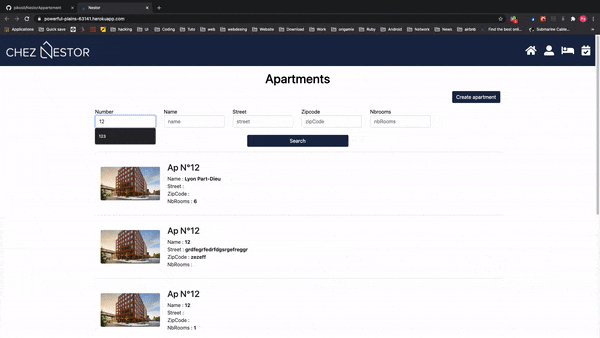
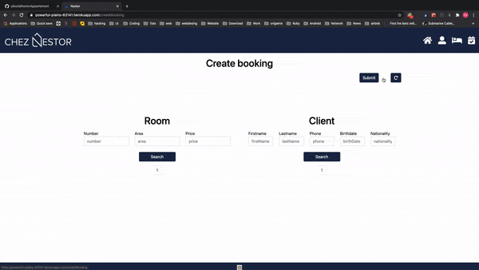
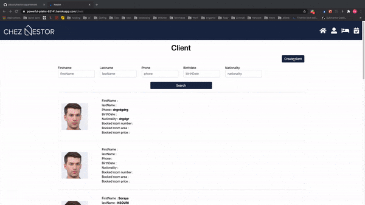
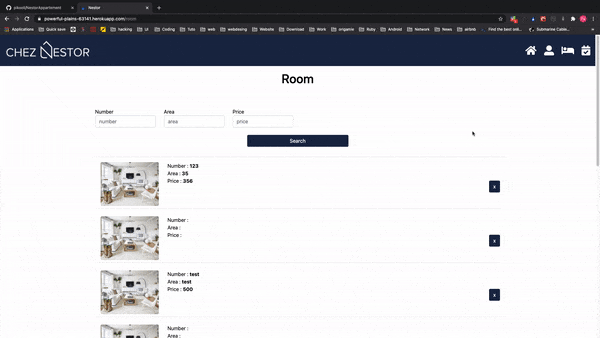

<a href="https://powerful-plains-63141.herokuapp.com/"><h1>Nestor</h1></a>

This project was done for a technical test at <a href="https://www.chez-nestor.com/en-us/search/Lyon">Nestor Lyon</a>
They have a testing api that we have to call to get data and post data.

Website hosted with free plan heroku (can take some time to start, so if nothing show refresh please)

work with 
NodeJS v15.3.0 <br/>
Npm v7.0.14 <br/>
ReactJS v17.0.1 <br/>
Bootstrap v5 <br/>

```
Do "npm i"
Launch with "npm start"
````

It have some minor test with jest, do "npm run test"
I only test some button, you can see them in src/Utils/Btn

Route : 
````
/ 
Show list of all apartments with pagination, allow to filter the list. 

/createApartment
Allow to create an apartment. Have persistent data with redux saved in localstorage, in case of a crash of browser or navigate to other page.

/apartment/:id
Show details of a apartment. You can add a room to the apartment from here 

/createRoom
Create a room for when creating a apartment.

/createRoom/:id
Add a room to a existing apartment.

/room
Show list of all rooms with pagination, allow to filter the list. You can permanently delete a room from here.

/client
Show list of all clients with pagination, allow to filter the list. 

/client/:id
Show details of a client

/createClient
Allow to create a client. 

/booking
Show list of all bookings with pagination, allow to filter the list. 

/booking/:id
Show details of a booking

/createBooking
Allow to create a booking. it let you choice in the list of room and client
`````
</img><br/>
</img><br/>
</img><br/>
</img><br/>

